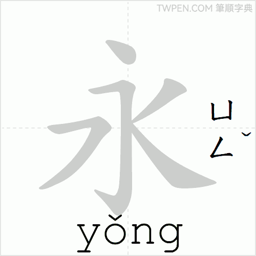
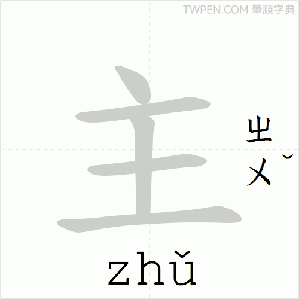

# 寫作

Jesuit missionaries Michele Ruggieri and Matteo Ricci arrived in China in the late sixteenth century. 
They set themselves to master the written Chinese characters, bridging their worlds, enabling prayers such as the Rosary to be beautifully expressed in Chinese. 
They translated the Hail Mary, the Our Father, the Creed, and the Sign of the Cross, recording them in the traditional forms still used today.

## Form and Meaning (形義)

Chinese characters are logographic. 
Each one carries its own meaning directly in its visible form and internal components, quite apart from the sounds used to speak it. 
The same character can be pronounced in entirely different ways across dialects or centuries, yet the sense it holds remains clear from the shape alone. 
This allows meaning to reside visibly in each character, transcending the spoken language of any one time or place.
The same forms that transmitted the prayers to China in the sixteenth century, continue to serve the same meanings today.

!!! quote "See the Form and Know the Meaning (見形知義)"
    The visual form of a character reveals its meaning. It arises from the system of the Six Writings (六書) as analyzed by Xu Shen (許慎) in the Shuowen Jiezi (說文解字) (c. 100 AD). In compound ideograph (會意) and pictogram (象形) characters, the components allow the reader to see the shape and immediately understand the sense.

    This principle is at work in the characters of the Rosary, where the strokes themselves visibly teach the truths of the faith.

!!! tip "Illustrations from the prayers"
    主 The character 主 sets a mark of sovereignty above the ancient form for a king. It appears throughout the Rosary to proclaim the Lordship of Christ, as when the Hail Mary declares that 主與妳同在, the Lord is with thee. This simple yet profound graph has borne the same confession of faith from the first Chinese translations to the present day.

    

    聖 The character 聖 unites the radical for the sacred with elements suggesting the ear and the mouth. It portrays holiness as that which is heard and proclaimed. In the Sign of the Cross the faithful invoke the name of the 聖神, the Holy Spirit, and the same form continues to shape every decade of the Rosary.

    

    父 The character 父 depicts a hand grasping a staff or rod. It renders visible the father as guide and protector. The Sign of the Cross opens with 因父, in the Father, and the Our Father addresses 天父, the heavenly Father, in the very strokes that have carried these prayers for generations.

    

    恩 The character 恩 places the heart radical beneath the graph for cause or reason. It reveals grace as the favor that moves the heart. The Hail Mary hails Mary as 充滿聖寵, full of holy grace, and this same 恩 has nourished the devotion of Chinese Catholics who pray the Rosary in the traditional characters.

    

---

## Traditional (繁體字)

All the prayers here appear in traditional characters (繁體字).

In the twentieth century the mainland introduced simplified characters intending to speed basic literacy. 
Many graphs lost strokes or were merged with others. 
For example, the traditional 發 once clearly separated the sense of "to issue" from "hair." Both collapsed into 发. 
Similar losses affected other pairs. 
The visual clues that once pointed to meaning and history were greatly reduced.

Chinese Catholics had already prayed the Rosary in traditional characters for generations. 
Those forms preserve the fuller structure of the characters and the continuity with the written language in which the faith first took root in China. 
The site therefore uses traditional characters throughout.

---

## Calligraphy (書法)

The practice of 書法 invites a different kind of attention. Each stroke is formed slowly, with care for order and balance. The hand moves while the mind holds the meaning of the prayer. In this way writing can become a form of contemplation.

The eight principles drawn from the character 永 (yǒng, eternal) describe the basic strokes.

!!! tip "Stroke order of 永"
    Follow each stroke as the animation plays. It begins with the 點 at the top, then the 橫, the 豎, and finishes with the hook and sweeps that give the character its balance. Trace the motion slowly by hand while reflecting on 永, eternal.

      
    From 筆順字典 (<a href="https://twpen.com" target="_blank" rel="noopener">twpen.com</a>)

!!! success "The eight principles of 永"
    - 點 (diǎn) -- the dot  
    - 橫 (héng) -- the horizontal  
    - 豎 (shù) -- the vertical  
    - 鉤 (gōu) -- the hook  
    - 提 (tí) -- the rising stroke  
    - 撇 (piě) -- the left-falling stroke  
    - 捺 (nà) -- the right-falling stroke  
    - 折 (zhé) -- the bent or folded stroke  

These are not abstract rules. They shape every character the prayers use.

Stroke order itself follows a simple logic developed for the brush: top before bottom, left before right, horizontals before verticals, enclosures before what they contain, center before the sides. When you follow it, the character holds together.

The character 主 appears throughout the Rosary prayers (for example in 主與妳同在).

!!! tip "Stroke order of 主"
    Watch the strokes form in order: it begins with the 點 that crowns it, then the 橫 and 豎 that form the cross, and ends with the bottom 橫. As the animation repeats, copy 主 by hand and pray the words that contain it, 主與妳同在.

      
    From 筆順字典 (<a href="https://twpen.com" target="_blank" rel="noopener">twpen.com</a>)

The animations above are for 永 and 主, two characters central to calligraphy practice and the Rosary prayers. Stroke order animations for many more characters that appear in the mysteries are available at [TW MOE](https://stroke-order.learningweb.moe.edu.tw/), [strokeorder.com](https://www.strokeorder.com/) or at [twpen.com](https://twpen.com).

---

## Input Methods (輸入方法)

There are many ways to type traditional Chinese characters. The main categories are phonetic methods (based on pronunciation) and shape-based methods (based on the form of the character). Which one works best depends on your pronunciation skills, the device, and whether you are in Taiwan, Hong Kong, or elsewhere.

!!! abstract "Pinyin (拼音)"
    拼音 is the most common method worldwide and the standard on the mainland. It uses the familiar Latin alphabet.

    You type the pinyin spelling (with or without tone numbers), and the input method suggests matching characters based on context and frequency.

    For example, to type 主 (zhǔ), enter "zhu" or "zhu3".

!!! abstract "Zhuyin (注音)"
    注音, also known as bopomofo, uses symbols based on traditional character shapes: ㄅㄆㄇㄈ and others.

    It is the everyday system in Taiwan. The symbols have no English equivalents, which helps learners avoid confusing Mandarin sounds with English phonetics.

    For 主, type ㄓㄨˇ.

!!! abstract "Cangjie (倉頡)"
    倉頡 is a powerful shape-based method widely used for traditional characters in Hong Kong and Taiwan.

    Characters are decomposed into basic components (24 main roots) assigned to letters on a standard keyboard. Once learned, it is fast and precise with little ambiguity.

    For example:

    - 主 : 卜土 (Y G)
    - 聖 : 尸口竹土 (S R H G)

    A simplified version called quick cangjie (速成) uses only the first and last codes for faster entry.

!!! abstract "Other Options"
    - Handwriting or stroke input: draw or enter strokes directly (useful on phones and tablets).
    - wubi (五筆): another shape-based system popular in some areas.

Most operating systems and phones (Windows, macOS, iOS, Android) support switching between these methods easily. Many modern IMEs combine phonetic and predictive features.

For English speakers, phonetic methods like pinyin (拼音) or zhuyin (注音) are the easiest starting point. Shape-based methods like cangjie (倉頡) become valuable for accuracy with traditional forms.
