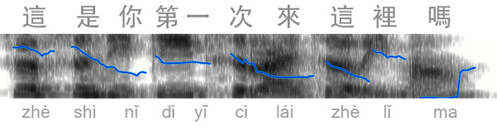

# 漢語 tones

Tones in Mandarin are easy, except when they’re not, which is every time a native Chinese speaker talks or tries to understand what you’re saying.

It’s commonly taught that there are only five tones ([four tones](https://en.wikipedia.org/wiki/Standard_Chinese_phonology#Tones), plus a neutral tone). You can learn those five tones quickly. I guess that’s really easy. Let’s look at (and listen to) a tone visualization (created in [Praat](http://www.fon.hum.uva.nl/praat/)). You can click on the image to hear the audio.

<audio id="tone-audio" src="tones-first-time-here.mp3" preload="auto"></audio>

There’s a lot going on here that doesn’t match the five tones. And it’s a native Mandarin speaker. When you ask native speakers what’s going on, they’ll respond as confused as if you asked a native English speaker why they have so many vowel sounds. In reality, there are 5 tones in Mandarin just like there are 5 vowels in English. It’s technically true, but in reality it’s much more complicated.

If you only learn 5 tones, you not only won’t understand native speakers, you won’t be understood when you speak.

Language teachers often say that you’ll master tones as you progress in your learning. A sort of natural discovery process. This should cause us to cringe. Let’s remember what the point of language teaching is:

> The whole point of language pedagogy is that it is a way of short-circuiting the slow process of natural discovery and can make arrangements for learning to happen more easily and more efficiently than it does in natural surroundings.

~ Henry Widdowson

The typical ways tones are taught do not short-circuit the slow process of natural discovery. Any educator (or educational resource) that refers to this kind of natural discovery is fundamentally failing at their job. It’s basically a polite way of saying, “I don’t know what that is, go figure it out yourself.”

Even for absolute beginners, it’s important to know that tones are more complicated than the “five tones” nonsense. Let’s break this down.

## Tone Sandhi

Tone change rules, or [Tone sandhi](https://en.wikipedia.org/wiki/Standard_Chinese_phonology#Tone_sandhi), should be the first indication that the “five tones” aren’t as simple as promised. If tone sandhi is brought up, it usually just refer to the 3rd tone, i.e.,

#### 3rd tone to 2nd

3rd tone followed by another 3rd tone becomes a 2nd tone. 老 + 鼠 = 老鼠 

That’s pretty easy. But then there’s also,

#### 3rd tone becomes low and flat

3rd tone followed by anything other than a 3rd tone becomes a “low flat tone”.

Look, a sixth tone! Sometimes this is described as a “half tone”, because it’s like the textbook 3rd tone except that it doesn’t rise. You’ll notice this “half tone” is actually the most common case of a 3rd tone, but I digress.

There are other rules, like,

#### 2nd tone becomes 1st

2nd tone after a 1st or 2nd tone becomes a 1st tone unless it’s spoken in isolation. This is kind of what happened in the example at the top of this page, notice that 來 was more like a first tone (although not as high).

There are also tone sandhi rules for specific characters, most commonly,

#### 一 (one) 

The number one, yī, is 1st tone in isolation and it becomes 2nd tone if it precedes a 4th tone ( 一定 ); and it becomes a 4th tone if it precedes a 1st, 2nd, or 3rd tone ( 一天 , 一年 , 一起 ).

However, this rule did not apply to the example at the top of this page. That is, 一次 should have been a 2nd tone followed by a 4th tone. But the native speaker emphasized the first tone in 第一次 , this is because any number following 第 is spoken in its original tone (even though it connects seamless to the 次 ).

#### 不 (do not) 

 不 becomes 2nd tone when it is followed by a 4th tone. Most commonly, 不是 

 不 can become a neutral tone when it’s part of the 是不是 pattern. Similarly, 沒 can become neutral in 有沒有 .

Importantly, you may never find an exhaustive list of all of the tone change rules, and you may find that the rules don’t always apply (especially across all native speakers). And like spelling rules in English, there are exceptions to the exceptions.

## Tone Pairs

Most Chinese words are two-syllables (two characters) and involve a distinct sounding “tone pair”. There are 20 distinct tone pairs (although the 3-3 and 2-3 are identical, so I guess 19).

Learning tone pairs is a wonderful way to identify new words as they’ll most often fit one of the 20 tone pairs.

Helpful resources for learning tone pairs:

+ [ma or ma](http://maorma.net), fun online game

+ [Yoyo Chinese](https://www.youtube.com/watch?v=taB08XWsuK0), part 1 on tone pairs

Also, John Pasden at [sinosplice.com](http://sinosplice.com) (who also wrote about using [Praat](http://www.sinosplice.com/life/archives/2008/01/21/seeing-the-tones-of-mand) to visualize tones) put together freely available [Tone Pair Drills](http://www.sinosplice.com/learn-chinese/tone-pair-drills) with audio examples of each of the tone pairs.

I loaded John’s tone pair drills into a flashcard app:

<button class="flashcard-green" onclick="Flashcards.open('zh/tones')">Practice tone pairs</button>

* * *

## Mimicry

In my opinion the best approach is to do drills with phrases by native speakers; try to copy the way they speak. Repeat until it becomes muscle memory, that is, until you’ve developed [automaticity](/tips/advice/#automaticity), and make sure you can be understood by native speakers.

I think the best examples are newscasters as they purposely speak in a way that can be understood. Find a radio or television personality who speaks in a way that you want to speak, and then listen/repeat in repetitive drills.
